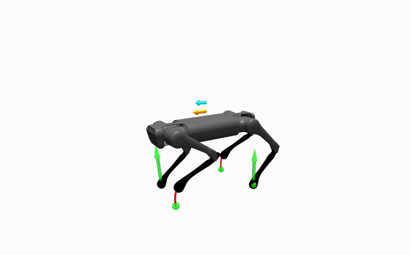

<div style="display: flex; justify-content: space-around;">
  
  
  
</div>


## Overview
This repo contains a model predictive controller based on the **single rigid body model** and written in **Python**. It comes in two flavours: gradient-based via [acados](https://github.com/acados/acados) or sampling-based via [jax](https://github.com/google/jax). The controller is tested on real robots and is compatible with [Mujoco](https://mujoco.org/). See [the end of this README](https://github.com/iit-DLSLab/Quadruped-PyMPC?tab=readme-ov-file#citing-this-work) if you want to cite this work.


Features gradient-based mpc:
- less than 5ms computation on an intel i7-13700H cpu 
- optional integrators for model mismatch
- optional smoothing for the ground reaction forces 
- optional foothold optimization
- optional [real-time iteration](http://cse.lab.imtlucca.it/~bemporad/publications/papers/ijc_rtiltv.pdf) or [advanced-step real-time iteration](https://arxiv.org/pdf/2403.07101.pdf)
- optional zero moment point/center of mass constraints
- optional lyapunov-based criteria


Features sampling-based mpc:
- 10000 parallel rollouts in less than 2ms on an nvidia 4050 mobile gpu!
- optional step frequency adaptation for enhancing robustness
- implements different strategies: [random sampling](https://arxiv.org/pdf/2212.00541.pdf), [mppi](https://sites.gatech.edu/acds/mppi/), or [cemppi](https://arxiv.org/pdf/2203.16633.pdf) 
- different control parametrizations: zero-order, linear splines or cubic splines (see [mujoco-mpc](https://arxiv.org/pdf/2212.00541.pdf))


## Dependencies
Gradient-based MPC: It uses [CasADI](https://web.casadi.org/) to define the model and [acados](https://github.com/acados/acados) to solve the optimal control problem. Sampling-based MPC: [jax](https://github.com/google/jax) for both. The simulation environment is based on [Mujoco](https://mujoco.org/).

## Installation

1. install [miniforge](https://github.com/conda-forge/miniforge/releases) (x86_64 or arm64 depending on your platform)

2. create an environment using the file in the folder [installation](https://github.com/iit-DLSLab/Quadruped-PyMPC/tree/main/installation) choosing between **nvidia and integrated gpu**, either **with or without ros** (to run the simulation, you don't need ros!):

    `conda env create -f mamba_environment.yml`


3. clone the other submodules:

    `git submodule update --init --recursive`
    
4. activate the conda environment

    `conda activate quadruped_pympc_env`

5. go inside the folder acados and compile it pressing:
    
    ```
    mkdir build
    cd build
    cmake -DACADOS_WITH_SYSTEM_BLASFEO:BOOL=ON ..
    make install -j4
    pip install -e ./../interfaces/acados_template
    ```

6. inside the file .bashrc, given your **path_to_acados**, put:
    
    ```
    export LD_LIBRARY_PATH=$LD_LIBRARY_PATH:"/path_to_acados/lib"
    export ACADOS_SOURCE_DIR="/path_to_acados"
    ```

    Notice that if you are using Mac, you should modify the file .zshrc adding
    
    ```
    export DYLD_LIBRARY_PATH=$LD_LIBRARY_PATH:"/path_to_acados/lib"
    export ACADOS_SOURCE_DIR="/path_to_acados"
    ```

The first time you run the simulation with acados, in the terminal you will be asked to install tera_render. You should accept to proceed.


7. go to Quadruped-PyMPC initial folder and install it:

    ```
    pip install -e .
    ```

## How to run - Simulation

1. activate the conda environment
   
   ```
   conda activate quadruped_pympc_env
   ```

2. go in the main Quadruped-PyMPC [folder](https://github.com/iit-DLSLab/Quadruped-PyMPC) and press
   
   ```
   python3 simulation/simulation.py
   ```

In the file [config.py](https://github.com/iit-DLSLab/Quadruped-PyMPC/blob/main/quadruped_pympc/config.py), you can set up the robot, the mpc type (gradient, sampling..), its proprierties (real time iteration, sampling type, foothold optimization..), and other simulation params (reference, gait type..). 

3. you can interact with the simulation with your mouse to add disturbances, or with the keyboard by pressing
```
arrow up, arrow down -> add positive or negative forward velocity
arrow left, arrow right -> add positive or negative yaw velocity
ctrl -> set zero all velocities
```

## How to run - ROS2
During the installation procedure, use the file **mamba_environment_ros2.yml**. Then:

1. activate the conda environment
   
   ```
   conda activate quadruped_pympc_ros2_env
   ```

2. go in the folder [ros2/msgs_ws](https://github.com/iit-DLSLab/Quadruped-PyMPC/tree/main/ros2/msgs_ws) and compile the messages
  
  ```
  colcon build
  source install/setup.bash
  ```

3. you can run now the script

  ```
  python3 src/run_controller.py
  ```

For a real-robot deployment, remember to put inside the script these flags to false

  ```
  USE_MUJOCO_RENDER = False
  USE_MUJOCO_SIMULATION = False
  ```

and to use a nice [state estimator](https://github.com/iit-DLSLab/muse). 

## Citing this work

If you find the work useful, please consider citing one of our works: 

[Sampling](https://arxiv.org/abs/2403.11383):
```
@INPROCEEDINGS{turrisi2024sampling,
  author={Turrisi, Giulio and Modugno, Valerio and Amatucci, Lorenzo and Kanoulas, Dimitrios and Semini, Claudio},
  booktitle={2024 IEEE/RSJ International Conference on Intelligent Robots and Systems (IROS)}, 
  title={On the Benefits of GPU Sample-Based Stochastic Predictive Controllers for Legged Locomotion}, 
  year={2024},
  pages={13757-13764},
  doi={10.1109/IROS58592.2024.10801698}}
```
[Lyapunov](https://arxiv.org/abs/2409.01144):
```
@ARTICLE{elobaid2025adaptivestablempc,
  author={Elobaid, Mohamed and Turrisi, Giulio and Rapetti, Lorenzo and Romualdi, Giulio and Dafarra, Stefano and Kawakami, Tomohiro and Chaki, Tomohiro and Yoshiike, Takahide and Semini, Claudio and Pucci, Daniele},
  journal={IEEE Robotics and Automation Letters}, 
  title={Adaptive Non-Linear Centroidal MPC With Stability Guarantees for Robust Locomotion of Legged Robots}, 
  year={2025},
  volume={10},
  number={3},
  pages={2806-2813},
  doi={10.1109/LRA.2025.3536296}}
```

## Maintainer

This repository is maintained by [Giulio Turrisi](https://github.com/giulioturrisi) and [Daniel Ordonez](https://github.com/Danfoa).
